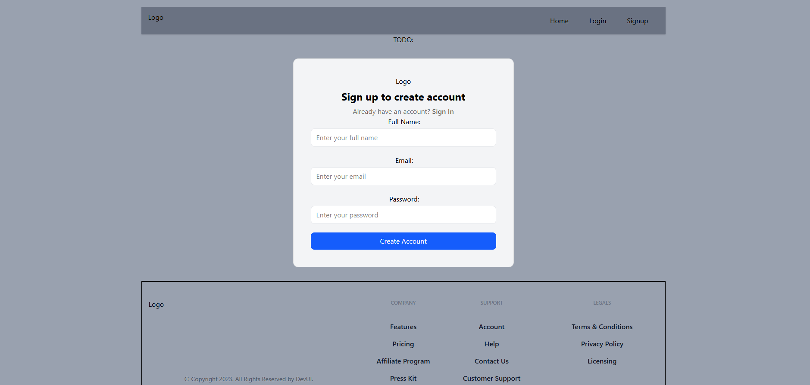
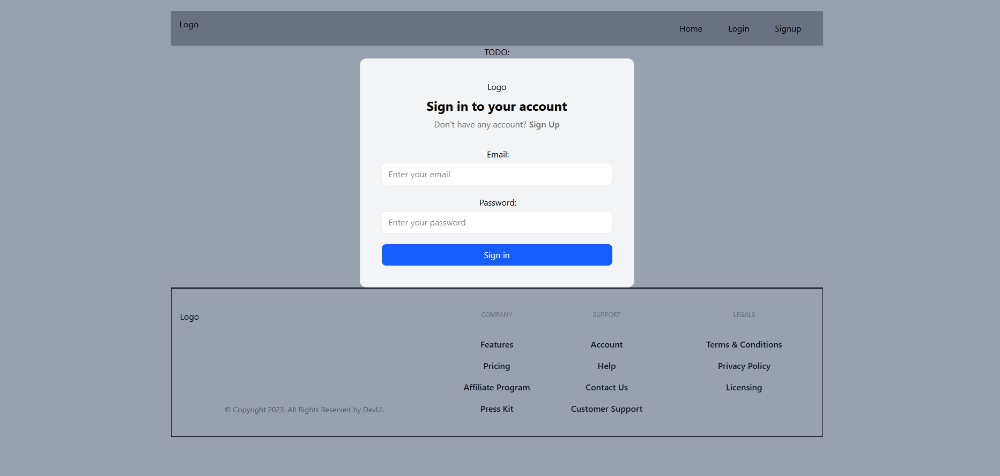
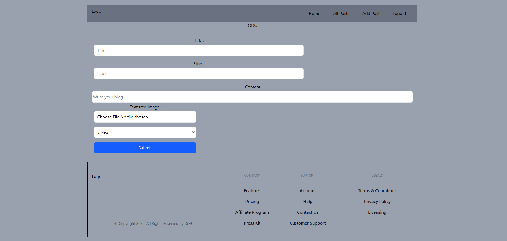
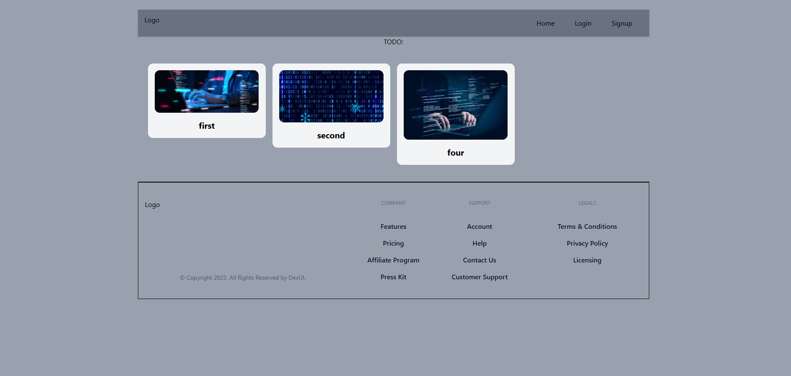

# 🚀 MegaBlog — Modern Blogging Platform

<p align="center">
  
  
  
  
  
</p>

<p align="center">
  A powerful full-stack blogging platform built with <b>React</b> and <b>Appwrite</b> 🚀  
  Create, manage, and explore blogs with a seamless user experience.
</p>

---

## 📸 Preview

<p align="center">
  
  <br/><br/>
  
  <br/><br/>
  <br/><br/>
  
</p>

---

## 📖 Project Description

**MegaBlog** is a modern full-stack blogging platform that allows users to create, manage, and explore blog content with a clean and intuitive interface.

The application provides a complete blogging experience — from user authentication to content creation — built using **React.js** for the frontend and **Appwrite** as the backend service.

Users can securely sign up, log in, and perform full **CRUD (Create, Read, Update, Delete)** operations on blog posts. Each post includes a title, slug, content, featured image, and status control.

---

## 🖥️ UI Overview

### 🏠 Home Page
- Displays multiple blog cards with images and titles  
- Clean grid layout for better readability  
- Navigation bar with authentication options  

### 🔐 Authentication Pages
- **Signup Page:** Create a new account with name, email, and password  
- **Login Page:** Secure user login system  
- Smooth and minimal UI design  

### 📝 Add Post Page
- Form-based blog creation  
- Fields include:
  - Title  
  - Slug  
  - Content  
  - Featured Image Upload  
  - Status (Active/Inactive)  
- Simple and user-friendly interface  

### 📚 Blog Management
- View all posts  
- Edit existing posts  
- Delete posts  
- Protected routes for authenticated users  

---

## 🎯 Key Highlights

- 🔐 Secure Authentication using Appwrite  
- 📝 Full Blog CRUD Functionality  
- 🖼️ Image Upload & Storage Integration  
- ⚡ Fast and Responsive Design  
- 🧩 Modular and Reusable Components  
- 🔄 Real-time Data Handling  

---

## 💡 Use Case

This project is ideal for:
- Personal blogging platforms  
- Content management systems  
- Learning full-stack development  
- Portfolio projects for developers  

---

## 🚀 Conclusion

MegaBlog demonstrates how to build a scalable and modern web application using React and backend-as-a-service tools like Appwrite. It highlights real-world development practices including authentication, routing, state management, and API integration.

---

## ✨ Features

- 🔐 Secure Authentication (Login / Signup)
- 📝 Create, Edit & Delete Blog Posts
- 📄 Dynamic Blog Pages (Routing)
- 📚 Explore All Posts
- 🖼️ Image Upload Support (Appwrite Storage)
- ⚡ Fast & Responsive UI
- 🧩 Clean & Reusable Component Structure

---

## 🧠 What I Learned

- ⚛️ Advanced React Concepts (Hooks, Routing)
- 🔗 API Integration using Appwrite SDK
- 🏗️ Scalable Project Structure
- 🔄 CRUD Operations in Real-world App
- 🎯 State & Component Management

---

## 🛠️ Tech Stack

| Category    | Technology |
|------------|-----------|
| Frontend   | React.js, React Router |
| Styling    | Tailwind CSS |
| Backend    | Appwrite |
| Database   | Appwrite DB |
| Storage    | Appwrite Storage |

---

## 📂 Project Structure

```
MegaBlog/
│
├── src/
│ ├── components/
│ │ ├── Container.jsx
| | ├── Footer.jsx
| | ├── Header.jsx
│ │ ├── PostCard.jsx
│ │ ├── PostForm.jsx
| | ├── AuthLayout.jsx
| | ├── Button.jsx
| | ├── Input.jsx
│ │ ├── Login.jsx
| | ├── Logo.jsx
| | ├── Select.jsx
| | ├── Signup.jsx
| | └── index.js
│ │
| ├── conf/
| | └── conf.js
| |
│ ├── pages/
│ │ ├── Home.jsx
│ │ ├── AllPosts.jsx
│ │ ├── AddPost.jsx
│ │ ├── EditPost.jsx
| | |── Login.jsx
│ │ ├── Post.jsx
│ │ └── Signup.jsx
│ │
| └── store/
| | |── authSlice.js
| | |── store.js
| |
│ ├── appwrite/
│ │ ├── auth.js
| | ├── config.js
│ │
│ ├── App.jsx
│ └── main.jsx
│
├── public/
├── package.json
└── README.md
```

---

## ⚙️ Setup Instructions

### 1️⃣ Install Dependencies
npm install

### 2️⃣ Configure Appwrite

  - appwriteUrl: "APPWRITE_URL",
  - appwriteProjectId: "PROJECT_ID",
  - databaseId: "DATABASE_ID",
  - collectionId: "COLLECTION_ID",
  - bucketId: "BUCKET_ID"

### 3️⃣Run Project
npm run dev

---

🔥Key Functionalities

- ✔️ User Authentication
- ✔️ Blog CRUD Operations
- ✔️ Protected Routes
- ✔️ Image Upload & Storage
- ✔️ Dynamic Routing

---

📈 Future Improvements

- 💬 Comments System
- ❤️ Like / Bookmark Feature
- 🔍 Search & Filters
- 🌐 Deployment with custom domain

---
